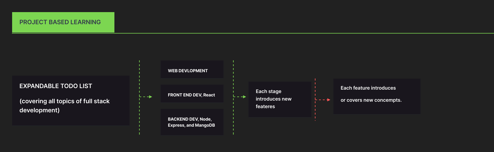
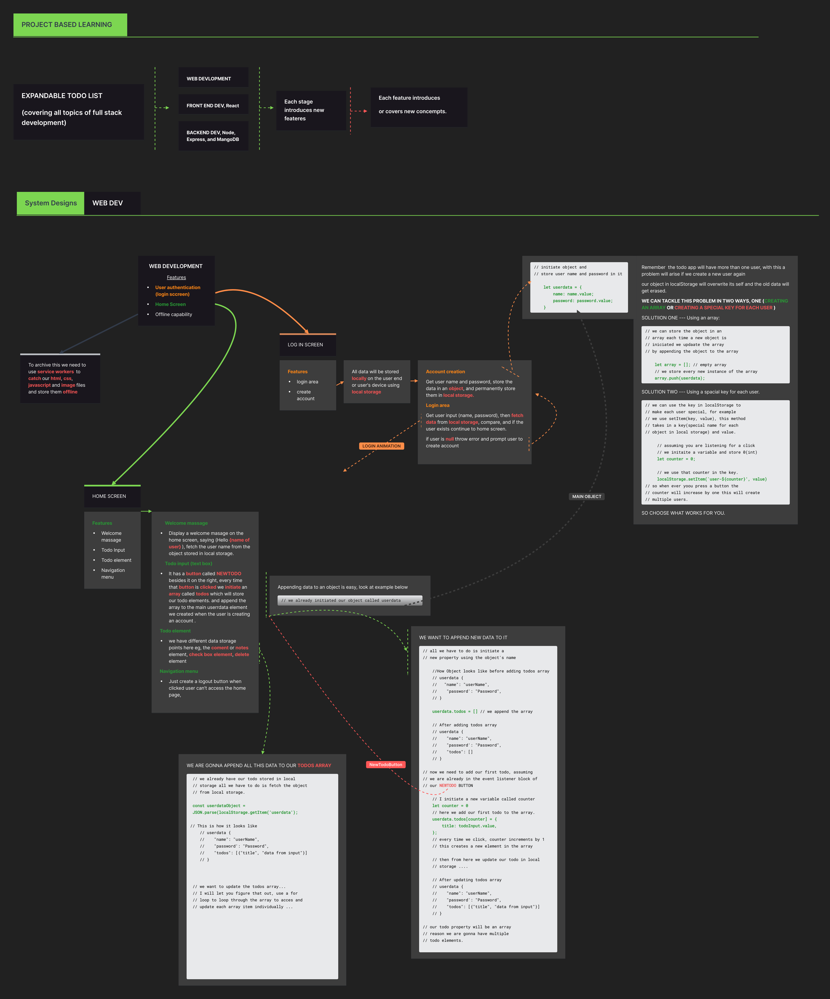

# JavaScript Full Stack Development Path 
# 
 By  Kato Isa  and  David Emong 

## Introduction

Welcome to the JavaScript Full Stack Development Path repository! This repository serves as a guide for beginners and intermediate learners who want to delve into full stack web development using JavaScript. The primary teaching method employed here is project-based learning, with a focus on building a feature-rich todo list application.

## Project Overview

In this repository, we will embark on a journey through various stages of web development, gradually building upon our skills and knowledge. Our central project is a todo list application, which will evolve and gain new features as we progress through different levels of proficiency.

### Levels:

1. **Web Development:**

Click to view full image

We'll start with the fundamentals of web development, including HTML, CSS, and vanilla JavaScript. Our initial todo list will be basic but functional, refer to system design image above for a clear view of the features included in the web virssion of the todo list ....

2. **Frontend with React:** Moving forward, we'll dive into frontend development using React. We'll enhance our todo list with interactive user interfaces and state management.

3. **Backend with Node.js and Express:** Next, we'll transition to backend development using Node.js and Express. We'll implement server-side logic to handle data storage and retrieval for our todo list.

4. **Database Integration with MongoDB:** Finally, we'll integrate MongoDB as our database solution. We'll learn how to connect our Node.js backend to MongoDB and perform CRUD operations for persistent todo list data.

## How to Use This Repository

Each level of the development path will have its own directory within the code folder in the repository. Inside each directory, you'll find code samples, exercises, and documentation relevant to that stage of learning. Follow the instructions provided in each directory to complete the tasks and advance to the next level.

I hope you enjoy this journey through JavaScript full stack development and find it valuable in your learning journey!

